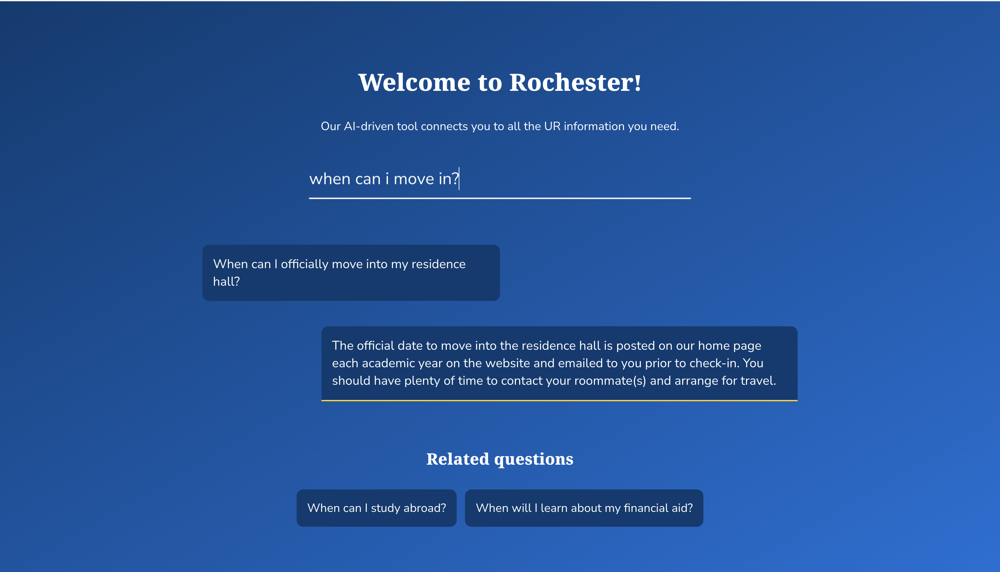

# UR Answered

What if there was a smart and user-friendly way to collect knowledge-management queries and automatically answer them?

Built as a demo during DandyHacks '22 to help our university answer new student questions.

## What it does
- A Node.js NLP model trained on commonly asked questions, grouped by university department. Uses the AXA Group NLP library.
- A user-friendly React + Sass widget with a chatbot-like interface for students to ask questions.
- An admin panel where administrators can answer questions for which the AI couldn't derive an answer. After each update, the NLP model then retrains itself automatically.

## Demo

## Challenges we ran into
- Lack of centralized knowledge. Maybe we could train our model on non-sensitive emails?

## For frontend:

- open web-app
- run `npm install`
- run `npm run start`

## For backend:

- run `npm install`
- run `node index`